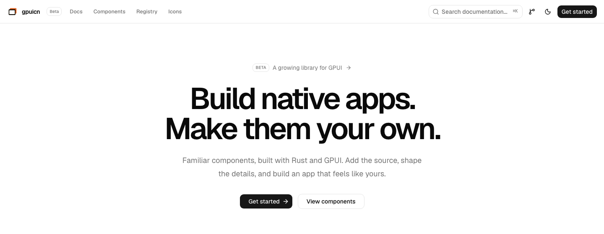
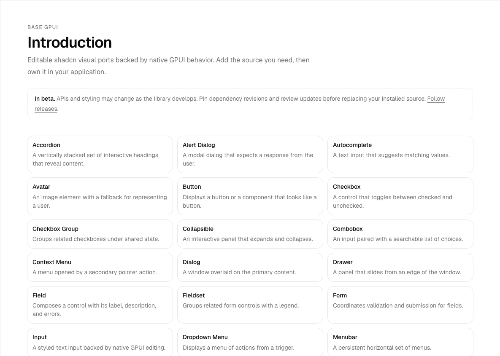

# gpuicn

<div align="center">
  
  <p>Native, editable UI components for <a href="https://www.gpui.rs/">GPUI</a>.</p>
  <p>
    <a href="https://ui.imajha.com/">Catalog</a> ·
    <a href="docs/registry.md">Install</a> ·
    <a href="docs/theming.md">Theming</a> ·
    <a href="https://github.com/devaryakjha/gpuicn/issues">Issues</a>
  </p>
</div>

gpuicn is an open-source library of Rust components for native GPUI apps.
Install the source in your app, then keep ownership of its styling and behavior.
Applications use [GPUI Kit](https://github.com/longbridge/gpui-kit) for native
controls, text editing, motion, and popup hosts. gpuicn supplies Nova styling and
application components. See the [migration notes](docs/validation/gpui-kit-migration.md)
for the new APIs and verification status.

The current beta supports GPUI Kit 0.6.1 and its pinned `gpui-pre` 0.3.4
runtime. Import GPUI types through `gpui_kit`; apps on another GPUI revision
must migrate before installing gpuicn source.

The project follows the shadcn/ui source distribution model. It brings shadcn's
visual language and themes to idiomatic GPUI APIs. It does not copy React APIs.

<p align="center">
  
</p>

<p align="center">
  
</p>

> [!WARNING]
> gpuicn is in beta. APIs and styling can change. Pin dependency revisions and review updates before replacing installed source.

The registry covers 40 component families, including Sidebar, Resizable, and Virtual List,
with shadcn Neutral Nova defaults. The catalog uses real GPUI/WASM previews.
Installed source stays editable.

- [Catalog](https://ui.imajha.com/)
- [Registry setup](docs/registry.md)
- [Source pins](release-pins.toml)
- [Desktop expansion plan and local review gates](docs/plans/desktop-components.md)
- [Full Lucide icon library](https://github.com/devaryakjha/gpui-icons)

## Install editable Rust source

The native CLI is not published to crates.io. Install the current published beta
from its Git tag and use the matching registry snapshot:

```sh
cargo install gpuicn-cli --git https://github.com/devaryakjha/gpuicn --tag v0.5.0-beta.3 --locked
# From your app directory:
gpuicn --registry https://raw.githubusercontent.com/devaryakjha/gpuicn/v0.5.0-beta.3/site/pages/r init
gpuicn add button sidebar
```

No Node.js is required. `gpuicn.toml` selects the registry and output directory.
The CLI copies shared modules and maintains `mod.rs`. Existing edits are kept
unless you pass `--overwrite`. See [setup and updates](docs/registry.md) for
Cargo dependencies and [theming](docs/theming.md) for colors, density, type,
radius, per-instance styles, and motion.

The tag and registry URL above pin the current published beta; they do not
include later fixes until a new release is tagged. To update, move both pins to
the same release, commit your app-specific edits, and use
`gpuicn add button sidebar --dry-run --overwrite` to list files before replacing
them. Review the resulting source diff after the actual overwrite.

[GitHub issue #58](https://github.com/devaryakjha/gpuicn/issues/58) tracks the
current adoption-readiness work. [TODO.md](TODO.md) preserves earlier local pass
records and desktop batches.

Launch the local workspace example app:

```sh
cargo run --release -p gpuicn-showcase --features gpui_platform/runtime_shaders
```

The app combines projects, tasks and local chat with saved state. The component
gallery is available with `-- --catalog`. Build a macOS app and website download with
`python3 scripts/package-showcase.py`. See [showcase packaging](docs/showcase.md)
for signing, validation, and distribution limits.

## Catalog development

The TanStack/shadcn website lives in `web/`. The Rust crate in `site/` builds
the embedded GPUI/WASM previews.

Use Rust 1.97.1 for native development, the pinned WASM nightly, Trunk 0.21.14,
and Bun. On macOS, native builds require Xcode's Metal toolchain.

```sh
rustup toolchain install nightly-2026-08-17 --component rust-src --target wasm32-unknown-unknown
cd site
RUSTUP_TOOLCHAIN=nightly-2026-08-17 CARGO_UNSTABLE_BUILD_STD=std,panic_abort trunk build --release --dist ../web/public/demo --public-url /demo/
cd ../web
bun install
bun run dev
```

The site generates its code examples and API reference from the same Rust source
used by the previews. It also includes a searchable gallery of all 1,818 Lucide
icons, backed by the standalone `gpui-icons` library.

## Verify changes

```sh
cargo test -p gpuicn --lib --locked
cargo clippy -p gpuicn --lib --tests --locked -- -D warnings
cargo check -p gpuicn-showcase --locked
cargo check -p gpuicn --example usage --locked
cd web
bun run build
bun run lint
```

CI builds the registry with Rust and checks native installation. It also installs
every registry item with the stock shadcn CLI. CI compares the installed source
byte for byte, tests overwrite behavior, and compiles the app.

## Platform scope

The components use GPUI Kit's native state and input behavior. The browser
catalog renders the same Rust components through WebGPU and WASM. It needs a
WebGPU-capable browser. Source and installation instructions remain available
when a preview cannot start.

The WASM canvas does not expose a browser accessibility tree. Relationship
attributes, nested overlays, motion, and other differences are documented per
component under `docs/parity/` and in the catalog. These are platform limits,
not claims of complete browser or shadcn behavioral parity.

## Contributing

Open an [issue](https://github.com/devaryakjha/gpuicn/issues) for a bug, parity
gap, or component request. Focused pull requests are welcome. Include the
checks that support the change.

## License

gpuicn is available under the [MIT License](LICENSE).
