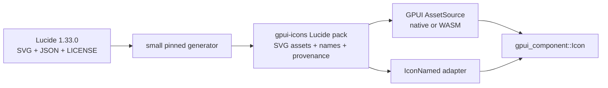

# Audit Lucide licensing and GPUI icon representations

Inspected 2026-08-24. This is source-based engineering guidance, not legal advice.

## Decision

Create `gpui-icons` from Lucide's own pinned SVG and JSON sources. Do not fork an existing community GPUI port and do not write another icon renderer.

The first Lucide package should preserve exact upstream SVG bytes, canonical kebab-case names, aliases/deprecations, contributor metadata, the upstream release tag and commit, and the complete upstream license. It should expose a typed Rust name-to-asset-path adapter for the existing `gpui_component::IconNamed` contract plus an asset source that works on native and WASM.



This gives `ui` the Lucide visuals it needs while leaving rendering, sizing, tint, and rotation in the existing GPUI component.

## Verified findings

### 1. Lucide can be reused and generated

The reproducible upstream is release [`1.33.0`](https://github.com/lucide-icons/lucide/releases/tag/1.33.0), commit [`59978cecf84986af59f1f9f503bcebdc89c6d166`](https://github.com/lucide-icons/lucide/commit/59978cecf84986af59f1f9f503bcebdc89c6d166), published 2026-08-19. The inspected release contains 1,776 `icons/*.svg` files. Do not track `main`; its inspected head was a later commit, [`33a44aa8b0b43d9b0ed14eb08860a1b5550a1573`](https://github.com/lucide-icons/lucide/commit/33a44aa8b0b43d9b0ed14eb08860a1b5550a1573).

Lucide's [complete license at that release](https://github.com/lucide-icons/lucide/blob/59978cecf84986af59f1f9f503bcebdc89c6d166/LICENSE) grants use, copying, modification, and free or paid distribution under ISC, provided the copyright and permission notice appears in every copy. The same file names the Feather-derived icons and includes their MIT terms. Therefore:

- generation, modification, packaging, and commercial use are allowed;
- every source and crate distribution containing Lucide assets must carry the complete upstream `LICENSE`, unchanged;
- copied SVGs must not be relabelled solely under `gpui-icons`' own code license;
- package metadata must describe the combined code and asset licenses; use a `license-file` when one SPDX expression would be misleading;
- there is no source-disclosure requirement in ISC or MIT.

Lucide's official package list contains no Rust or GPUI package. Its framework-neutral [`@lucide/icons` guide](https://github.com/lucide-icons/lucide/blob/59978cecf84986af59f1f9f503bcebdc89c6d166/docs/guide/packages/icons.md) expressly describes icon data as ordered SVG child nodes and allows third-party framework integrations. `gpui-icons` should call itself an unofficial GPUI port; the software license does not state a trademark grant.

Lucide excludes brand logos because they carry separate copyright and trademark risks. The Lucide importer must follow the same boundary; brand marks need a different reviewed source and license. See Lucide's [official brand-logo statement](https://github.com/lucide-icons/lucide/blob/59978cecf84986af59f1f9f503bcebdc89c6d166/BRAND_LOGOS_STATEMENT.md).

### 2. SVG is already the right GPUI representation

Lucide's canonical inputs are `icons/<kebab-name>.svg` and the matching JSON metadata. For example, [`house.svg`](https://github.com/lucide-icons/lucide/blob/59978cecf84986af59f1f9f503bcebdc89c6d166/icons/house.svg) carries the 24×24 view box, no fill, `currentColor`, 2px stroke, and round caps/joins; [`house.json`](https://github.com/lucide-icons/lucide/blob/59978cecf84986af59f1f9f503bcebdc89c6d166/icons/house.json) carries contributors, tags, categories, and the deprecated `home` alias. The [metadata schema](https://github.com/lucide-icons/lucide/blob/59978cecf84986af59f1f9f503bcebdc89c6d166/icon.schema.json) also represents icon deprecation, alias deprecation reasons, and future removal versions.

GPUI already accepts SVG asset paths, external SVG paths, or raw SVG bytes through [`Svg::path`, `Svg::external_path`, and `Svg::data`](https://github.com/zed-industries/zed/blob/d9ad6aff67e47de43abb270d22de75dd950f1b48/crates/gpui/src/elements/svg.rs#L15-L62). Its paint path treats SVGs as monochrome alpha masks and applies the supplied GPUI color at draw time ([`paint_svg`](https://github.com/zed-industries/zed/blob/d9ad6aff67e47de43abb270d22de75dd950f1b48/crates/gpui/src/window.rs#L4420-L4482)). Raw Lucide SVG therefore preserves the intended linework and supports theme tinting without converting SVG paths into Rust drawing commands.

The cost of that renderer is explicit: it is monochrome. Zed's own icon component also states that its SVG renderer does not support polychrome SVGs ([source](https://github.com/zed-industries/zed/blob/d9ad6aff67e47de43abb270d22de75dd950f1b48/crates/ui/src/components/icon.rs#L129-L141)). That is fine for Lucide and must remain part of the icon-pack contract; future multicolor packs need a separate decision.

### 3. Reuse the current component contract, not its icon files

At the inspected Longbridge revision, the reusable icon component is in the styled `gpui-component` crate (`crates/ui`), not `gpui-base`. Its public [`IconNamed` trait](https://github.com/longbridge/gpui-component/blob/334bbed2e8c47d606eb79ab05ddcebd60b823429/crates/ui/src/icon.rs#L9-L29) maps a typed name to an embedded asset path. `Icon` then owns path loading, inherited text color, sizing, and rotation ([source](https://github.com/longbridge/gpui-component/blob/334bbed2e8c47d606eb79ab05ddcebd60b823429/crates/ui/src/icon.rs#L84-L127), [rendering](https://github.com/longbridge/gpui-component/blob/334bbed2e8c47d606eb79ab05ddcebd60b823429/crates/ui/src/icon.rs#L145-L199)). `gpui-icons` only needs to supply names and bytes.

Longbridge already proves both asset paths:

- native builds embed `icons/**/*.svg` with `rust-embed` and implement GPUI's `AssetSource` ([source](https://github.com/longbridge/gpui-component/blob/334bbed2e8c47d606eb79ab05ddcebd60b823429/crates/assets/src/native_assets.rs#L5-L34));
- WASM builds fetch `assets/<icon-path>` on demand and cache the bytes ([source](https://github.com/longbridge/gpui-component/blob/334bbed2e8c47d606eb79ab05ddcebd60b823429/crates/assets/src/wasm_assets.rs#L8-L88)).

That makes a real in-browser icon path plausible for the interactive catalog. The current WASM loader returns an error during the first fetch and expects a later GPUI retry, so the catalog prototype must verify first-paint and retry behavior before treating this as settled.

Longbridge's generated enum scans filenames and maps each variant to `icons/<filename>.svg` ([macro](https://github.com/longbridge/gpui-component/blob/334bbed2e8c47d606eb79ab05ddcebd60b823429/crates/macros/src/lib.rs#L61-L80), [generation](https://github.com/longbridge/gpui-component/blob/334bbed2e8c47d606eb79ab05ddcebd60b823429/crates/macros/src/lib.rs#L113-L168)). This is a useful API shape, but `gpui-icons` should generate from Lucide metadata as well as filenames so aliases and provenance are not lost.

### 4. Existing ports are references, not safe upstreams

| Source | Pinned revision | What it proves | Why not adopt it |
|---|---|---|---|
| [Longbridge `gpui-component`](https://github.com/longbridge/gpui-component/tree/334bbed2e8c47d606eb79ab05ddcebd60b823429) | `334bbed2e8c47d606eb79ab05ddcebd60b823429` | 99 SVG assets, typed names, native embedding, WASM fetch | It is a small application set, not full Lucide. Its inspected assets README declares Apache-2.0 and no Lucide notice was found under `crates/assets`; use Lucide itself for provenance. |
| [everbuild `lucide-gpui`](https://github.com/everbuild-org/lucide-gpui/tree/99c0f20a8cb1ad87b255fc541a99d77da669fb4e) | `99c0f20a8cb1ad87b255fc541a99d77da669fb4e` | 1,435 embedded SVGs and an asset-load hook | Last code revision is from 2024, README says it is not actively maintained, its GPUI revision is old, and crates.io returned no `lucide-gpui` crate on 2026-08-24. |
| [joris-gallot `gpui-lucide`](https://github.com/joris-gallot/gpui-lucide/tree/add0d802c6aae4dcb813949e638fb71eaf34e645) | `add0d802c6aae4dcb813949e638fb71eaf34e645` | 1,701 SVGs and a simple build-time enum generator | Unpublished on crates.io; its manifest says MIT, but the inspected tree has no license file or Lucide notice and no recorded Lucide pin. |
| [RustForWeb `lucide`](https://github.com/RustForWeb/lucide/tree/82133b679a7b0e70de67baf38dbd6fe8bcd81fc2) | `82133b679a7b0e70de67baf38dbd6fe8bcd81fc2` | A maintained community Rust generation approach | It targets Dioxus, Leptos, and Yew, not GPUI; it is not an official Lucide package. |
| [Zed icons](https://github.com/zed-industries/zed/tree/d9ad6aff67e47de43abb270d22de75dd950f1b48/crates/icons) | `d9ad6aff67e47de43abb270d22de75dd950f1b48` | Typed names plus tests that every enum and SVG path agrees | Zed says most icons start from Lucide but are modified to its 16×16 visual system ([guidelines](https://github.com/zed-industries/zed/blob/d9ad6aff67e47de43abb270d22de75dd950f1b48/crates/icons/README.md#L3-L24)); it is a different visual set and [its crate is GPL-3.0-or-later](https://github.com/zed-industries/zed/blob/d9ad6aff67e47de43abb270d22de75dd950f1b48/crates/icons/Cargo.toml#L1-L7). |

The two crates.io absence checks used the public endpoints for [`lucide-gpui`](https://crates.io/api/v1/crates/lucide-gpui) and [`gpui-lucide`](https://crates.io/api/v1/crates/gpui-lucide); both returned “crate does not exist” on the inspection date.

## Initial `gpui-icons` contract

### Source and release pin

Record this in a machine-readable file and change it only in an explicit update PR:

```toml
[upstream]
repository = "https://github.com/lucide-icons/lucide"
tag = "1.33.0"
commit = "59978cecf84986af59f1f9f503bcebdc89c6d166"
inspected = "2026-08-24"
```

Use an explicit allow-list for the first common icons. One icon request adds one allow-list entry and regenerates. Do not import all 1,776 until a consumer needs that product choice.

### Identity and API

- Canonical identity: exact upstream kebab-case filename without `.svg`.
- Asset path: reserve a family prefix now, such as `icons/lucide/<name>.svg`, so later families cannot collide.
- Rust identity: deterministic PascalCase derived from the canonical name, with an explicit rule for digit-leading names and a generation-time collision check.
- Adapter: a `LucideIcon` enum (or equivalent generated type) implements `gpui_component::IconNamed`; do not ship a second `Icon` component.
- Aliases: generate deprecated Rust aliases from the upstream JSON, pointing to the canonical icon. Do not copy JavaScript-only wrapper aliases such as `LucideHouse` or `HouseIcon`.
- Enumeration is optional for v0.1. Add `all()` only when the catalog search needs it; typed construction and `path()` are enough for components.

### Visual data

Preserve the upstream SVG bytes and child order. Do not hand-copy `path d` values and do not normalize files merely for formatting. The contract must preserve view box, fill/stroke, stroke width, line cap/join, and every child tag and attribute. If a later GPUI renderer bug forces a transform, record the transform, tool version, input hash, output hash, and a clear modified-file notice in the provenance manifest.

### Attribution and traceability

Ship:

1. Lucide's exact release `LICENSE`, including the Feather-derived icon list and MIT license.
2. A generated provenance manifest with, per imported icon: canonical name, Rust name, upstream SVG and JSON paths, SHA-256 hashes, contributors, aliases/deprecation fields, and whether the name appears in Lucide's Feather-derived list.
3. A short README credit: “Unofficial GPUI port generated from Lucide,” with the pinned release link.

Contributor metadata is not an extra license condition in the inspected license, but retaining it makes authorship auditable and keeps updates honest.

### Asset delivery

Keep asset delivery separate from icon identity:

- native: embed the allow-listed SVGs;
- WASM: either embed the small v0.1 allow-list or fetch and cache it from the catalog's own origin;
- expose one composable `AssetSource`/load hook rather than taking over application startup;
- fail clearly for an unknown path; never silently draw a wrong fallback icon.

Do not decide full-pack bundling, dynamic search, icon fonts, custom vector primitives, or multicolor rendering in v0.1. None is required for Button, Checkbox, Dialog, or their catalog previews.

## Smallest acceptance checks

The generator should fail unless all of these hold:

1. The configured tag resolves to the configured commit.
2. The exact upstream license is present in the generated distribution.
3. Every allow-listed SVG and JSON file exists and matches its recorded hash.
4. Canonical names, Rust names, paths, and aliases are unique and valid.
5. Generated paths load through the native asset source.
6. A small representative set renders at 12, 16, and 24 pixels with inherited color: one path-only icon (`check`), one multi-element icon, and one aliased icon (`house`/`home`).
7. The same representative set loads in the WASM catalog without a permanent blank first paint.

## Remaining boundary

This ticket resolves source, license, representation, and minimum contract. A separate `gpui-icons` map still needs to decide repository/crate naming, the first allow-list, release automation, and how its asset source composes with application assets. Those decisions do not block `ui` from specifying `gpui_component::IconNamed` plus Lucide SVG paths as its icon dependency.
