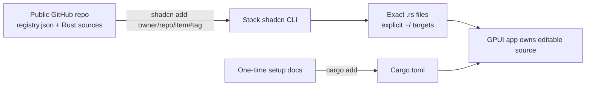

# Test shadcn registry as a GPUI source distributor

Resolved on 2026-08-24 against official shadcn docs and `shadcn-ui/ui` commit [`ac60ef5`](https://github.com/shadcn-ui/ui/commit/ac60ef5c4db4265d71454dd9ecd3f93e255d7211).

## Decision

Use the stock shadcn GitHub registry for the first GPUI release. It can install `.rs` files into a Rust-only project without `package.json`, `components.json`, Tailwind, or framework detection when each installable unit is a **universal item**:

- the item type is `registry:item` or `registry:file`;
- every file has an explicit target;
- every file type is `registry:item` or `registry:file`.

Publish the public repo with a root `registry.json`, install with `shadcn add owner/repo/item#ref`, and use explicit project-root targets such as `~/src/ui/button.rs`.

Stock shadcn does **not** understand Cargo dependencies or merge `Cargo.toml`. For v0.1, keep `gpui`, `base-gpui`, and `gpui-icons` as one-time documented setup dependencies and keep component items source-only. Do not build an adapter yet. If automatic per-item crate dependencies become a real requirement, the smallest adapter is a thin wrapper that delegates file installation to shadcn and delegates manifest edits to `cargo add`.



## Capability result

| Question | Result | Consequence |
| --- | --- | --- |
| Arbitrary Rust files | **Yes** | Use universal items; shadcn copies `.rs` content unchanged. |
| Explicit targets | **Yes** | Use `~/...` targets for stable paths relative to the project root. |
| Configurable target aliases | **Not cleanly in Rust-only projects** | Do not require `components.json` or TypeScript aliases for v0.1. A caller may use `--path`, but it is not a saved GPUI config contract. |
| Public GitHub as registry | **Yes** | A root `registry.json` is enough; no registry server or generated JSON endpoint is needed. |
| Source-item dependencies | **Yes** | Use `registryDependencies` with full GitHub item addresses and pinned refs. |
| Cargo dependency metadata | **No native meaning** | `dependencies` and `devDependencies` are npm fields. Custom `meta` is carried but ignored by stock installation. |
| `Cargo.toml` merge | **No** | Never ship `Cargo.toml` as a copied registry file; it would be treated as a whole file, not merged. |
| Repeat install | **Content-idempotent** | Identical files are skipped. Changed files prompt before overwrite; `--overwrite` replaces them. There is no three-way merge or installed-item lockfile. |
| Adapter needed for v0.1 | **No** | One-time `cargo add` setup plus stock source installs is enough for the proof slice. |

## Verified facts

### 1. Rust files are valid registry payloads

The official GitHub registry guide says a GitHub source registry can distribute “any files,” including source, config, docs, templates, workflows, and conventions; it requires a public repo, root `registry.json`, valid schemas, and source files that exist in the repo. It also documents direct installation as `shadcn add <username>/<repo>/<item>`. [GitHub Registries](https://ui.shadcn.com/docs/registry/github)

The item schema places no extension restriction on `files[].path`; it stores `path`, optional `content`, `type`, and optional or required `target` depending on the type. [`schema.ts` lines 50–97](https://github.com/shadcn-ui/ui/blob/ac60ef5c4db4265d71454dd9ecd3f93e255d7211/packages/shadcn/src/registry/schema.ts#L50-L97)

The CLI defines universal items as `registry:item` or `registry:file` whose files all have explicit targets and are themselves `registry:item` or `registry:file`. The source comment says these items install without framework detection or a full project config. [`registry/utils.ts` lines 277–309](https://github.com/shadcn-ui/ui/blob/ac60ef5c4db4265d71454dd9ecd3f93e255d7211/packages/shadcn/src/registry/utils.ts#L277-L309)

When `add` resolves such an item, it calls the installer and returns **before** normal project preflight. The normal preflight would otherwise require `package.json` and `components.json`. [`commands/add.ts` lines 79–129](https://github.com/shadcn-ui/ui/blob/ac60ef5c4db4265d71454dd9ecd3f93e255d7211/packages/shadcn/src/commands/add.ts#L79-L129), [`preflight-add.ts` lines 16–48](https://github.com/shadcn-ui/ui/blob/ac60ef5c4db4265d71454dd9ecd3f93e255d7211/packages/shadcn/src/preflights/preflight-add.ts#L16-L48)

For universal file types, the writer skips all React/TypeScript/Tailwind transforms and uses the supplied content as-is. That is the key property for Rust source. [`update-files.ts` lines 164–198](https://github.com/shadcn-ui/ui/blob/ac60ef5c4db4265d71454dd9ecd3f93e255d7211/packages/shadcn/src/utils/updaters/update-files.ts#L164-L198)

The official tests also assert that any file extension is accepted, and that a universal registry item bypasses preflight/init. [`update-files.test.ts` lines 813–887](https://github.com/shadcn-ui/ui/blob/ac60ef5c4db4265d71454dd9ecd3f93e255d7211/packages/shadcn/src/utils/updaters/update-files.test.ts#L813-L887), [`commands/add.test.ts` lines 591–606](https://github.com/shadcn-ui/ui/blob/ac60ef5c4db4265d71454dd9ecd3f93e255d7211/packages/shadcn/src/commands/add.test.ts#L591-L606)

### 2. Target handling works, with a narrow contract

`target: "~/src/ui/button.rs"` resolves from the consumer project root. Plain relative targets can be rewritten under `src/` when the CLI detects a JavaScript project with a source directory, so `~/...` is the safer cross-project form. [`update-files.ts` lines 395–450](https://github.com/shadcn-ui/ui/blob/ac60ef5c4db4265d71454dd9ecd3f93e255d7211/packages/shadcn/src/utils/updaters/update-files.ts#L395-L450)

The CLI's `--path` override is useful for one-off placement, but it is not equivalent to shadcn's saved alias config: an exact file path applies only to the first file, while a directory override places every file by basename in that directory. This can flatten multi-file layouts. [`update-files.ts` lines 397–417](https://github.com/shadcn-ui/ui/blob/ac60ef5c4db4265d71454dd9ecd3f93e255d7211/packages/shadcn/src/utils/updaters/update-files.ts#L397-L417)

Alias targets such as `@ui/...` resolve from `components.json`. A normal Rust-only repo cannot use that path cleanly because full config resolution requires a JS/TS config and normal preflight requires `package.json`. [`get-config.ts` lines 47–97](https://github.com/shadcn-ui/ui/blob/ac60ef5c4db4265d71454dd9ecd3f93e255d7211/packages/shadcn/src/utils/get-config.ts#L47-L97)

**Decision:** v0.1 uses one documented default root, `~/src/ui/`, and allows a caller to override simple one-file items with `--path`. A persisted GPUI alias/config format is deferred until users need it.

### 3. GitHub registry support is sufficient

The official guide supports public GitHub repositories directly and requires no registry server. [GitHub Registries](https://ui.shadcn.com/docs/registry/github)

The current resolver recognizes GitHub item addresses separately and fetches them through the GitHub source reader. [`resolver.ts` lines 79–129](https://github.com/shadcn-ui/ui/blob/ac60ef5c4db4265d71454dd9ecd3f93e255d7211/packages/shadcn/src/registry/resolver.ts#L79-L129)

The source reader resolves the requested ref to a commit SHA, reads root `registry.json`, and fetches source files from `raw.githubusercontent.com`. [`github.ts` lines 159–275](https://github.com/shadcn-ui/ui/blob/ac60ef5c4db4265d71454dd9ecd3f93e255d7211/packages/shadcn/src/registry/github.ts#L159-L275)

The docs allow tags and full commit SHAs in GitHub item addresses. They also warn that refs are not inherited by dependencies. Each same-repo dependency must use a full address and its own tag or SHA. [registry-item.json: `registryDependencies`](https://ui.shadcn.com/docs/registry/registry-item-json#registrydependencies)

**Decision:** consumer docs should show a release tag, not mutable HEAD:

```sh
npx shadcn@latest add devaryakjha/ui/button#v0.1.0
```

Each source dependency should likewise be explicit, for example `devaryakjha/ui/theme#v0.1.0`.

### 4. Dependency metadata splits into source dependencies and npm dependencies

`registryDependencies` recursively resolves other registry items, including GitHub item addresses. [`resolver.ts` lines 174–210](https://github.com/shadcn-ui/ui/blob/ac60ef5c4db4265d71454dd9ecd3f93e255d7211/packages/shadcn/src/registry/resolver.ts#L174-L210)

The official schema docs define `dependencies` as npm runtime packages and `devDependencies` as npm development packages. [registry-item.json: dependencies](https://ui.shadcn.com/docs/registry/registry-item-json#dependencies), [registry-item.json: devDependencies](https://ui.shadcn.com/docs/registry/registry-item-json#devdependencies)

The dependency updater confirms the behavior: it reads `package.json`, chooses an npm-compatible package manager, and executes that manager's add/install command. [`update-dependencies.ts` lines 11–87](https://github.com/shadcn-ui/ui/blob/ac60ef5c4db4265d71454dd9ecd3f93e255d7211/packages/shadcn/src/utils/updaters/update-dependencies.ts#L11-L87), [`update-dependencies.ts` lines 218–253](https://github.com/shadcn-ui/ui/blob/ac60ef5c4db4265d71454dd9ecd3f93e255d7211/packages/shadcn/src/utils/updaters/update-dependencies.ts#L218-L253)

The schema accepts arbitrary `meta`, so a future wrapper could define `meta.cargoDependencies`, but stock shadcn does not act on it. [`schema.ts` lines 79–97](https://github.com/shadcn-ui/ui/blob/ac60ef5c4db4265d71454dd9ecd3f93e255d7211/packages/shadcn/src/registry/schema.ts#L79-L97)

**Decision:**

- use `registryDependencies` for GPUI source items such as theme tokens or shared helpers;
- leave `dependencies` and `devDependencies` unset for GPUI items;
- add the common Rust crates once during project setup with `cargo add`;
- use the item's `docs` field to print any required setup note; the CLI prints resolved item docs after installation. [`add-components.ts` lines 124–151](https://github.com/shadcn-ui/ui/blob/ac60ef5c4db4265d71454dd9ecd3f93e255d7211/packages/shadcn/src/utils/add-components.ts#L124-L151)

### 5. `Cargo.toml` must not be distributed as a file

There is no Cargo-specific field or updater in the current registry schema or dependency updater. The generic file writer can copy `Cargo.toml`, but it treats it like any other whole file: identical content is skipped; different content prompts for overwrite or is replaced with `--overwrite`. It does not merge TOML tables. [`update-files.ts` lines 200–298](https://github.com/shadcn-ui/ui/blob/ac60ef5c4db4265d71454dd9ecd3f93e255d7211/packages/shadcn/src/utils/updaters/update-files.ts#L200-L298)

Shipping a full manifest would risk deleting or replacing consumer settings. The native `cargo add` command is the smallest safe manifest editor when automation becomes necessary.

### 6. Repeat installs are safe only at the file level

If an installed file matches the incoming content, shadcn skips it. If it differs, the interactive command asks before overwrite; without interaction it skips unless overwrite is enabled; `--overwrite` performs a full replacement. [`update-files.ts` lines 200–257](https://github.com/shadcn-ui/ui/blob/ac60ef5c4db4265d71454dd9ecd3f93e255d7211/packages/shadcn/src/utils/updaters/update-files.ts#L200-L257)

There is no installed-item manifest, semantic version state, or three-way merge in this path. Version control remains the rollback and review mechanism.

One current CLI caveat: the universal-item shortcut runs only for a real install, not `--dry-run`, `--diff`, or `--view`. Those modes continue into normal preflight and can demand JS project files in a Rust-only repo. [`commands/add.ts` lines 77–129](https://github.com/shadcn-ui/ui/blob/ac60ef5c4db4265d71454dd9ecd3f93e255d7211/packages/shadcn/src/commands/add.ts#L77-L129), [`commands/add.ts` lines 167–221](https://github.com/shadcn-ui/ui/blob/ac60ef5c4db4265d71454dd9ecd3f93e255d7211/packages/shadcn/src/commands/add.ts#L167-L221)

## Recommended v0.1 item shape

```json
{
  "name": "button",
  "type": "registry:item",
  "registryDependencies": [
    "devaryakjha/ui/theme#v0.1.0"
  ],
  "files": [
    {
      "path": "registry/button/button.rs",
      "type": "registry:item",
      "target": "~/src/ui/button.rs"
    }
  ],
  "docs": "Requires the one-time GPUI UI setup dependencies."
}
```

This shape uses the universal path, preserves Rust source, avoids React transforms, and installs without adding JavaScript project files.

## Adapter threshold

Do **not** create a custom registry service or installer for v0.1. Add a wrapper only when either becomes a release requirement:

1. component-specific Cargo dependencies must be added automatically; or
2. users need a saved, shadcn-like configurable Rust target path across installs.

The minimum wrapper should:

1. call stock shadcn for registry resolution and file writes;
2. call native `cargo add` for declared crate dependencies;
3. keep any GPUI-only fields in registry item `meta` or a small sidecar manifest;
4. avoid parsing or rewriting `Cargo.toml` itself.

That preserves shadcn's transport and overwrite behavior while adding only the Rust behavior it lacks.

## Final answer

Stock shadcn is a good source distributor for this project. It already handles public GitHub transport, arbitrary Rust files, explicit targets, recursive source dependencies, pinned refs, and repeat installs. The only hard gap is Cargo-aware dependency management, plus a weaker optional gap around persisted target configuration. Neither blocks the v0.1 proof slice if common crates are installed once and every component is a universal source-only item.
